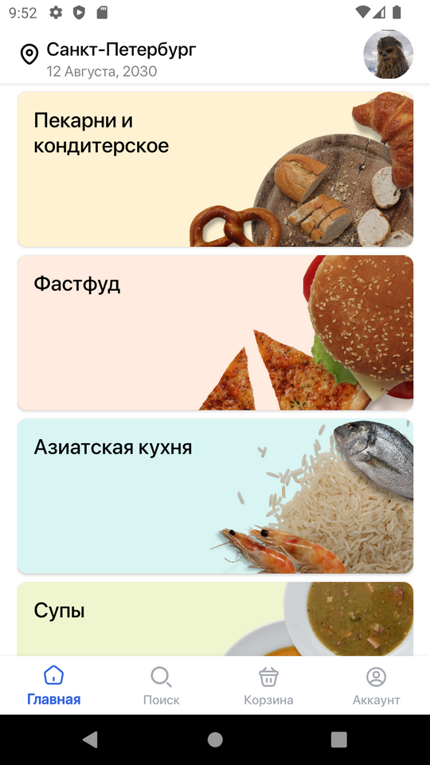
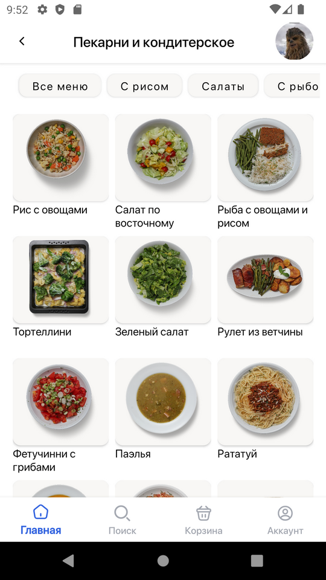
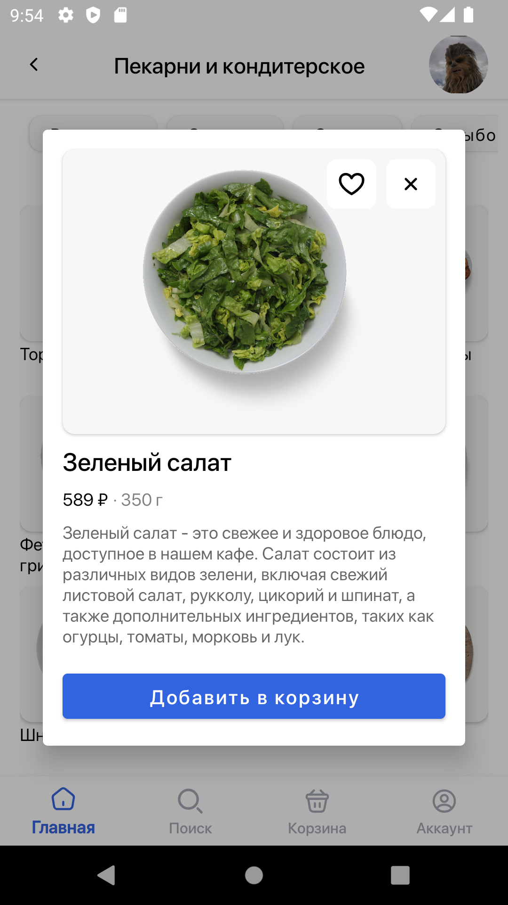
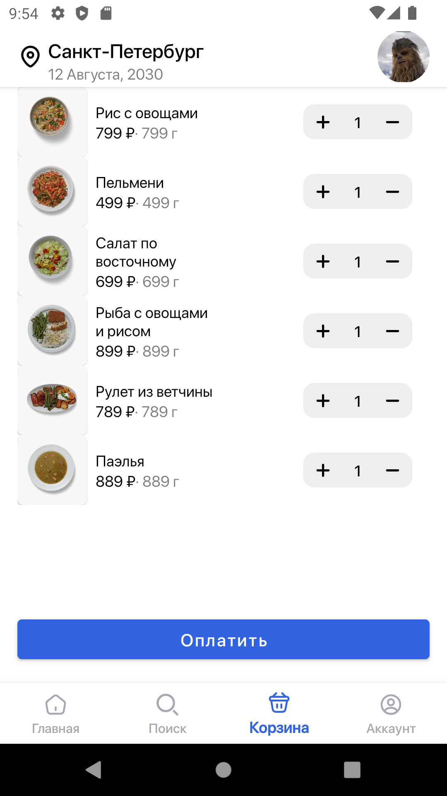

# FoodDelivery
FoodDelivery

В файл ApiDishService подставить нужные эндпоинты для запросов.

Простое приложение с фейковым Api для демонстрации слоёв Clean Architecture и многомодульности.

### Стек:

* Kotlin
* MVVM
* LiveData
* Hilt
* AdapterDelegates
* Coroutines/Flow
* Cicerone
* Room
* TOML (version catalogs)

 

 

Telegram: @MegaDedh
